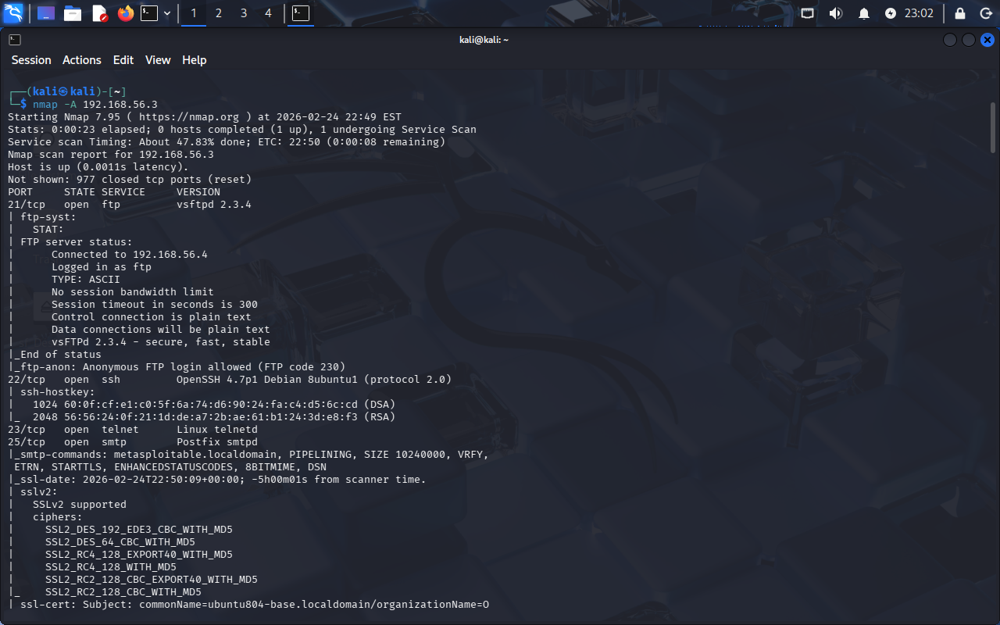
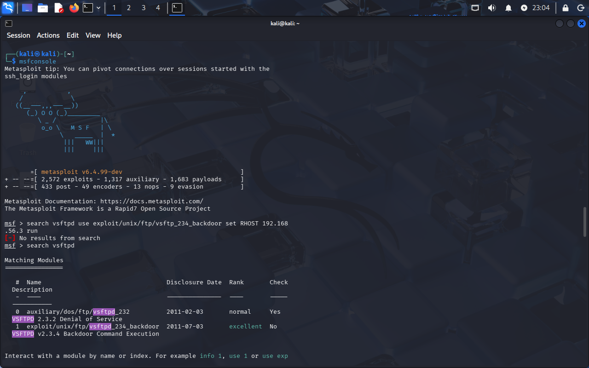
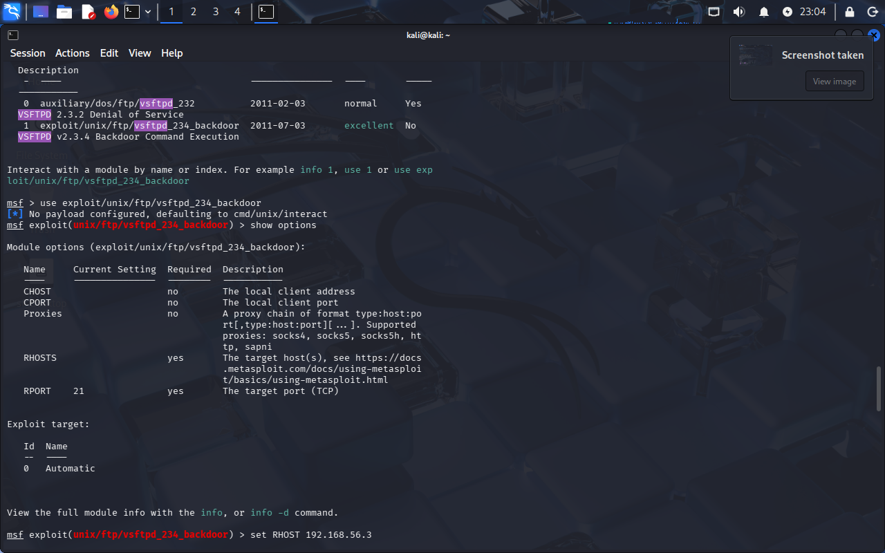
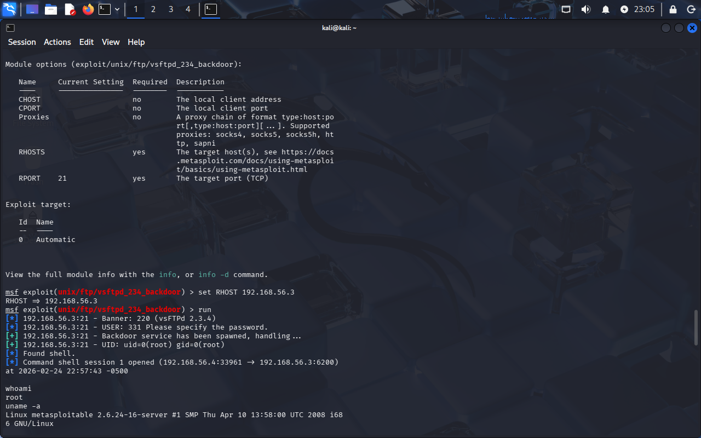

# 🛡 Metasploitable 2 Penetration Testing Lab

## Overview
Penetration testing lab performed in a controlled VirtualBox Host-Only network using Kali Linux against Metasploitable 2.  
Scope: Recon → Exploitation → Privilege Escalation.

## Lab Environment
- **Attacker:** Kali Linux — `192.168.56.4`
- **Target:** Metasploitable 2 — `192.168.56.3`
- **Network:** VirtualBox Host-Only

## Method (High Level)
1. **Recon:** Identify open ports/services (Nmap).
2. **Exploit:** Gain initial shell via a vulnerable service.
3. **PrivEsc:** Enumerate misconfigurations (SUID) and escalate to root.

## Evidence (Screenshots)
---

---
## Report
Detailed write-up: `report/Metasploitable_PenTest_Report.pdf`

## Disclaimer
Educational use only in a controlled lab environment.
